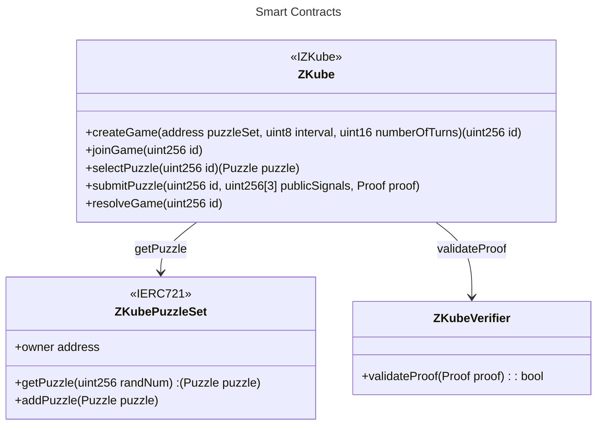

# ZK Cube Composer

This game is inspired by [Cube Composer](https://david-peter.de/cube-composer/).

## Rules

Two players will play against eachother in a pvp style game.

A **game** consists of a set of puzzles which are solved by each player in sequence of rounds. Each puzzle for each round is randomly selected with a deterministic read-only function, this ensures each player always gets the same puzzle.

A **puzzle** consists of a starting grid, a final grid, and a set of available functions to use.

A **function** will mutate the grid, and the puzzle is solved by achieving the final grid.

A zero-knowledge proof is generated for each round submission and sent to a smart contract, where it is validated and the number of blocks it took to solve the round is recorded. A correct submission results in an extra point, the player at the end of the game with the most points will be the winner. In the eventuality of a draw, the player who submitted in the smallest amount of blocks will be deemed the winner.

## Smart Contracts

### Addresses

The contracts are deployed to Arbitrum Sepolia at these addresses:

- `ZKubeVerifier`: [0xCD16264739Be32Fb2A170ba87ba3a6a21A82D4bc.](https://sepolia.arbiscan.io/address/0xCD16264739Be32Fb2A170ba87ba3a6a21A82D4bc)
- `ZKube`: [0x4dC21759056209717C121d2bFb8b548302934fbC.](https://sepolia.arbiscan.io/address/0x4dC21759056209717C121d2bFb8b548302934fbC)
- `ZKubePuzzleSet`: [0x31D234a75Fdc64ca43b2600c0a85B79A9ED3E3F7.](https://sepolia.arbiscan.io/address/0x31D234a75Fdc64ca43b2600c0a85B79A9ED3E3F7)

The **ZKube** contract is the only contract players will interact with. The first player will create a game using `createGame` and the second player will join using `joinGame`, the game will start X blocks after this. The players will get the puzzle by calling `selectPuzzle` and they will submit the proof of their solution using `submitProof`. The game can be resolved when it is finished by calling `resolveGame`

The **ZKubePuzzleSet** ERC721 contract defines a set of possible puzzles in a game contract, this makes the game very composable as it allows the community to create different sets of puzzles by deploying different **ZKubePuzzleSet** contracts - we will create a small set of puzzles as a POC.

## Circuits

[TODO]

## Application Architecture

The front-end is a NextJS app deployed to Vercel.

The interactions will happen directly from the browser to the network the game exists on. There is no need for a backend for this demo. It is possible that we might benefit from a backend in a future update, this is why we chose NextJS.

## Grid Layout

The grid is 8x8 and there are 4 possible colours.
Each column of 8 is appended sequentially in base4. We chose base4 to limit the permutations for demo purposes and to save storage space when encoding to hexadecimal bytes for the EVM. Here are the colour representations: \
&nbsp; 0 = no block / no colour. \
&nbsp; 1 = yellow \
&nbsp; 2 = red \
&nbsp; 3 = blue

The columns are appended from left to right and from the bottom up. For example, a column with 1 yellow square at the bottom would be represented by 10000000. We append each column and the result is a base4 number of 64 length.

We will encode this from base4 (saves storage space) to hexadecimal bytes16.

## Considerations

1. The games are most fair when there are lots of puzzles as it makes it almost impossible to know the solution to a puzzle.

## Improvements

1. We prove that the player knows the solution but we don't prove that he knows a solution from the pre-defined set of functions. This means players can use any functions with any arguments to mutate the grid and get the ZK proof for the desired solution. Whilst it is more difficult to choose your functions and arguments from a bigger list, we are planning to create a ZK proof that the user only used functions from the available list.
