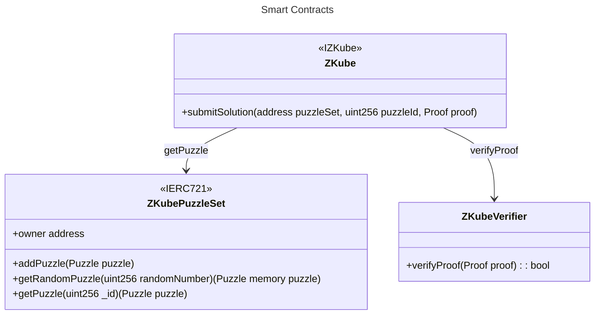

# zKube

Puzzle game inspired by [Cube Composer](https://david-peter.de/cube-composer/) and verified using ZK proofs.

https://github.com/mycenaean-n/zkomposer/zkomposer.mp4

## Rules

A **puzzle** consists of a starting grid, a final grid, and a set of available functions to use.

A **function** will transform the grid, and the puzzle is solved by achieving the final grid.

A zero-knowledge proof is generated for each puzzle and sent to a smart contract, where it is validated. A correct submission results in a new entry to the mapping of solved puzzles.

## Smart Contracts

### Addresses

The contracts are deployed to Arbitrum Sepolia at these addresses:

- `ZKube`: [0xd98f77077a776481557ff562d19799809a71e05f](https://sepolia.arbiscan.io/address/0xd98f77077a776481557ff562d19799809a71e05f)

- `ZKubePuzzleSet`: [0x13cd31c4c3345e712a6501a040e8278b15107b32](https://sepolia.arbiscan.io/address/0x13cd31c4c3345e712a6501a040e8278b15107b32)

- `ZKubeVerifier`: [0xdbeec58fdedf8dd1b397e43618817035474a6555](https://sepolia.scrollscan.com/address/0xdbeec58fdedf8dd1b397e43618817035474a6555)

The **ZKube** contract is the contract players will interact with to submit their solutions.

The **ZKubePuzzleSet** ERC721 contract defines a set of possible puzzles in a game contract, this makes the game very composable as it allows the community to create different sets of puzzles by deploying different **ZKubePuzzleSet** contracts - we will create a small set of puzzles as a POC.

## Circuits

The ZKube circuit is the main circuit that integrates game logic, which is divided among five separate circuits. Each of these circuits performs a distinct manipulation on the grid:

- `Stack`: Stacks elements of value `color`, of type `0 | 1 | 2 | 3`, on top of the grid.

- `Transform`: Transforms elements in the grid from value `colorIn` to `colorOut`, both of which are of type `0 | 1 | 2 | 3`.

- `TransformTwo`: Stacks elements of value `colorOut`, of type `0 | 1 | 2 | 3`, on top of elements with value `colorIn`, of type `0 | 1 | 2 | 3`.

- `Filter`: Filters columns containing elements of value `color`, of type `0 | 1 | 2 | 3`.

- `Reject`: Removes elements of value `color`, of type `0 | 1 | 2 | 3` from a grid.

The design of the circuits facilitates easy updates. New circuits containing transformation logic can be seamlessly integrated into the `ZKube` circuit without the need for extensive rewrites of its logic.

## Application Architecture

The front-end is a Next.js app deployed to Vercel.

The interactions will happen directly from the browser to the network the game exists on. There is no need for a backend for this demo. It is possible that we might benefit from a backend in a future update, this is why we chose NextJS.

## Grid Layout

The grid is 12x12 and there are 4 possible colours.
Each column of 12 is appended sequentially in base4. We chose base4 to limit the permutations for demo purposes and to save storage space when encoding to hexadecimal bytes for the EVM. Here are the colour representations: \
&nbsp; 0 = no block / no colour. \
&nbsp; 1 = yellow \
&nbsp; 2 = red \
&nbsp; 3 = blue

We will encode this from base4 (saves storage space) to hexadecimal bytes16.

## Considerations

1. Circuits are not audited and without the trusted set up.
